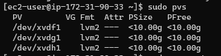

# WEB SOLUTION WITH WORDPRESS

## This project is aimed at preparing storage infrastructure on two Linux servers and implement a basic web solution using WordPress

### Step 1 - Prepare a Web Server

Spin your instance and attached 3 volumes to the web server

open up the Linus terminal to begin configuration

1. Inspect block deviced using `lsblk`

 

 Check for all  mounts and free space

 

- Create single partition for all the disks. You will get outcomes that looks like what you see below;

 

 

 

- Use the `lsblk` command to view the newly configured partitions

 

- Install lvm2

 `sudo yum install lvm`

 

 .PNG)

- Use pvcreate utility to mark each of 3 disks as physical volumes

 

- Verify Physical Volumes

 

- Use lvcreate utility to create 2 logical volumes

 `sudo lvcreate -n apps-lv -L 14G webdata-vg`
 `sudo lvcreate -n logs-lv -L 14G webdata-vg`

- Verify it was successfully created

 `sudo lvs`

 

- Verify the entire setup

 `sudo vgdisplay -v`

 

 `sudo lsblk`

 

- Use mkfs.ext4 to format the logical volumes with ext4 filesystem

 `sudo mkfs -t ext4 /dev/webdata-vg/apps-lv`

 `sudo mkfs -t ext4 /dev/webdata-vg/logs-lv`

 

- Create /var/www/html directory to store website files

 `sudo mkdir -p /var/www/html`

- Create /home/recovery/logs to store backup of log data

 `sudo mkdir -p /home/recovery/logs`

- Mount /var/www/html on apps-lv logical volume

 `sudo mount /dev/webdata-vg/apps-lv /var/www/html/`

 

  Use rsync utility to backup all the files in the log directory /var/log into /home/recovery/logs

 `sudo rsync -av /var/log/. /home/recovery/logs/`

- Mount /var/log on logs-lv logical volume

 sudo mount /dev/webdata-vg/logs-lv /var/log

 

### UPDATE THE `/ETC/FSTAB` FILE

- Get the UUID of the device

 `sudo blkid`

 

- Update /etc/fstab with the UUID

 `sudo vi /etc/fstab`

 

- Test the configuration

 `sudo mount -a`

 

- Reload daemon

 `sudo systemctl daemon-reload`

 

- Verify Setup

 `df -h`

 

### Repeat same process for the Database Server

Spin the database server instance and attach 3 volumes to it.

- Create single partition for all the disks. You will get outcomes that looks like what you see below;

 

 .PNG)

 

- View newly configured partition

 `lsblk`

 

- Install lvm2 package.

 `sudo yum install lvm2`

 

- Use pvcreate utility to mark each of 3 disks as physical volumes

 `sudo pvcreate /dev/xvdf1 /dev/xvdg1 /dev/xvdh1`

 

- Add all 3 PVs to a volume group (VG)

 `sudo vgcreate webdata-vg /dev/xvdh1 /dev/xvdg1 /dev/xvdf1`

 

- Use lvcreate utility to create 2 logical volumes

 `sudo lvcreate -n db-lv -L 20G database-vg`

 

- Use mkfs.ext4 to format the logical volumes with ext4 filesystem

 `sudo mkfs.ext4 /dev/database-vg/db-lv`

 

- Create /db directory to store data

 `sudo mkdir /db`

- Mount /dev/database-vg/db-lv on /db

 `sudo mount /dev/database-vg/db-lv /db`

 

- Updated FSTAB

 `sudo vi /etc/fstab`

- Test Configuration

 `sudo mount -a`

 

- Reload Daemon

 `sudo systemctl daemon-reload`

 

### Install WordPress on your Web Server EC2

- Update the repository

 `sudo yum -y update`

- Install wget, Apache and it’s dependencies

 `sudo yum -y install wget httpd php php-mysqlnd php-fpm php-json`

 

- Start Apache
 `sudo systemctl enable httpd`
 `sudo systemctl start httpd`

 

- Install PHP and it’s dependencies

`sudo yum install https://dl.fedoraproject.org/pub/epel/epel-release-latest-8.noarch.rpm`

`sudo yum install yum-utils http://rpms.remirepo.net/enterprise/remi-release-8.rpm`

`sudo yum module list php`
`sudo yum module reset php`
`sudo yum module enable php:remi-7.4`
`sudo yum install php php-opcache php-gd php-curl php-mysqlnd`

`sudo systemctl start php-fpm`
`sudo systemctl enable php-fpm`
`setsebool -P httpd_execmem 1`

- Restart Apache

 `sudo systemctl restart httpd`

 

- Download wordpress and copy wordpress to var/www/html
 `mkdir wordpress`
 `cd   wordpress`
 `sudo wget http://wordpress.org/latest.tar.gz`

 

 `cp wordpress/wp-config-sample.php wordpress/wp-config.php`

 `cp -R wordpress /var/www/html/`

 

- Configure SELinux Policies

 `sudo chown -R apache:apache /var/www/html/wordpress`

 `sudo chcon -t httpd_sys_rw_content_t /var/www/html/wordpress -R`

 `sudo setsebool -P httpd_can_network_connect=1`

 

### Install MySQL on your DB Server EC2

- Update server and install MySql-Server

 `sudo yum update`

 `sudo yum install mysql-server`

 

- Verify MySQL server is running

 `sudo systemctl restart mysqld`
 `sudo systemctl enable mysqld`
 `sudo systemctl status mysqld`

 

### Configure DB to work with WordPress

- Configurw Database to work with WordPress

 Run the command `sudo mysql`
 Then;
 `CREATE DATABASE wordpress;`

 

### Configure WordPress to connect to remote database

- Open MySQL port 3306 on DB Server EC2

- Install MySQL client and test that you can connect from your Web Server to your DB server
 `sudo yum install mysql`

  `sudo mysql -u verve -p -h 172.31.84.77`

- Change permissions and configuration so Apache could use WordPress

 

- Enable TCP port 80 in Inbound Rules configuration for your Web Server EC2

 

 Set up your login details and login. You should see something like the screenshots below

 

 
